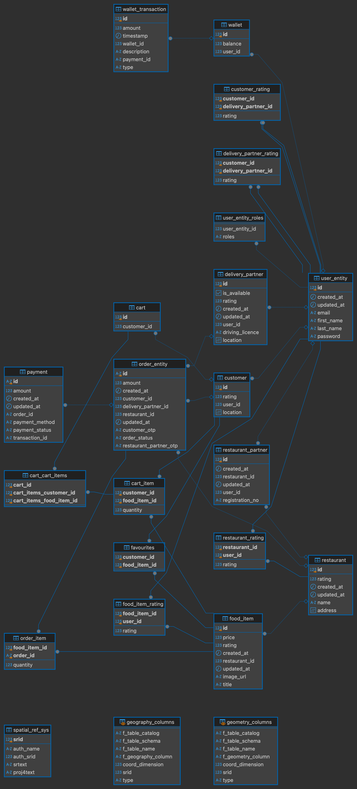

# QuickBites - Food Delivery Application

**Technologies**: Java, Spring Boot, PostgreSQL, AWS Elastic Beanstalk, AWS RDS

## ER Diagram


## Overview

QuickBites is a scalable food delivery application designed to connect customers, delivery partners, and restaurant partners. The platform streamlines the process of ordering food, managing deliveries, and supporting partner restaurants while maintaining real-time notifications for all stakeholders.

The application offers separate interfaces and functionalities for customers, delivery partners, restaurant partners, and administrators, ensuring a seamless user experience tailored to each role.

Below is the Entity Relationship Diagram (ERD) representing the database structure for QuickBites:



## Features

### User Roles
- **Customer**
- **Delivery Partner**
- **Restaurant Partner**
- **Admin**

### Customer Features
- **Food Search**: Find food items based on a variety of filters such as cuisine, price, rating, and more.
- **Cart Management**: Add, remove, or modify food items in the cart and proceed to checkout.
- **Favorites Management**: Add or remove food items from your favorite list for easy access.
- **Payment**: Pay for orders using the in-app wallet system.

### Delivery Partner Features
- **Order Management**: Accept, pick up, cancel, or deliver orders efficiently, keeping track of the current status.

### Restaurant Partner Features
- **Restaurant Registration**: Register your restaurant on the platform, allowing customers to order from you.
- **Menu Management**: Add or update your restaurant's menu, making it easier for customers to browse.
- **Order Handling**: Accept or cancel orders based on availability and capacity.

### Admin Features
- **Onboard Delivery Partners**: Manage the onboarding process for new delivery partners.
- **Onboard Restaurant Partners**: Register new restaurant partners on the platform.

### System Features
- **Notification Service**: Automated notifications sent to customers, delivery partners, and restaurant partners during key events (e.g., order status updates).

## Architecture

- **Backend**: Built using Java and Spring Boot, ensuring a modular and scalable backend.
- **Database**: PostgreSQL for data persistence, optimized for handling a large number of orders, partners, and customer data.
- **Cloud Deployment**: Hosted on AWS Elastic Beanstalk, providing robust scalability and easy deployment.
- **Database Hosting**: AWS RDS for secure, reliable, and scalable database management.

### Swagger UI Endpoint:
     http://quickbites-env.ap-south-1.elasticbeanstalk.com/swagger-ui/index.html
## Installation

1. **Clone the repository**:
   ```bash
   git clone https://github.com/itsjaypatel/QuickBites

2. **Set up PostgreSQL:**
- Ensure you have PostgreSQL installed and running.
- Create a new database and update the connection details in application.properties.

3. **Run the application**
   ```bash
   mvn spring:boot:run

4. **Access the Application**: The application will be available at http://localhost:8080 at locally.
